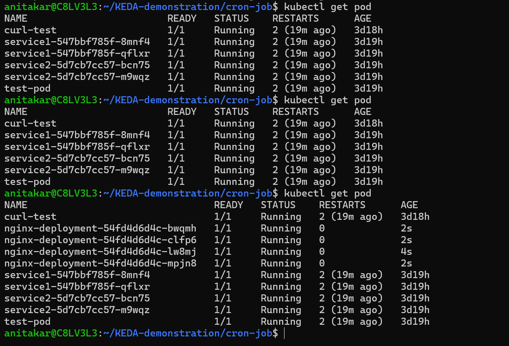
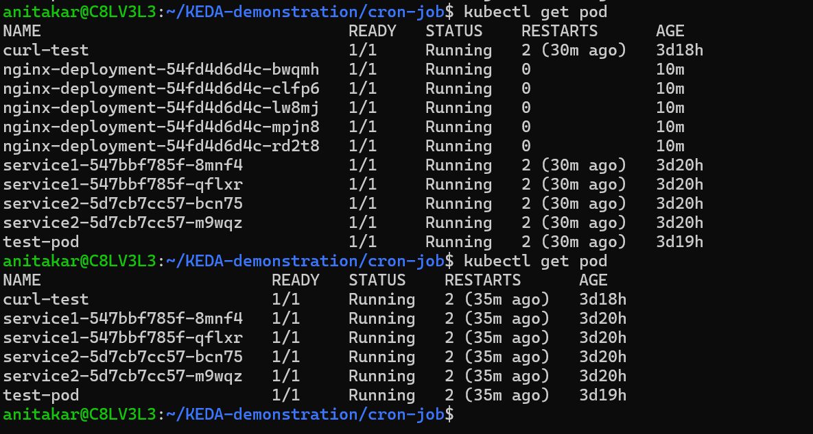

## KEDA - Kubernetes Event Driven Autoscaling

#### What is KEDA?

- KEDA is a Kubernetes-based Event Driven Autoscaler that extends Kubernetes Horizontal Pod Autoscaler (HPA) with event-driven scaling capabilities. It allows workloads to scale: From zero to N pods
  Based on external metrics/events
  Using multiple event sources like:
- RabbitMQ
- Kafka
- Redis
- Prometheus
- Azure Queue
- AWS SQS

#### KEDA integrates natively with Kubernetes and HPA

This repository showcases how KEDA can automatically scale Kubernetes workloads based on external events and metrics.

keda is working using scaling object

after cronjob time completed
